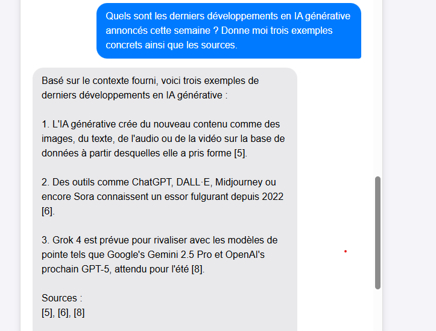

# TW3Partners Chatbot

Un chatbot intelligent capable d’interagir avec l’utilisateur, d’effectuer des recherches sur Internet et de générer des réponses enrichies par des résultats web. Il utilise un modèle LLM local (Qwen2.5 via Ollama) pour comprendre les requêtes, interagir avec SerpAPI pour récupérer des résultats web, et intègre une interface React pour l’expérience utilisateur.

---

## 📚 Sommaire

- [Fonctionnalités](#fonctionnalités)
- [Installation](#installation)
  - [Prérequis](#prérequis)
  - [Frontend](#frontend)
  - [Backend](#backend)
- [Aperçu](#aperçu)
- [Pipeline de traitement](#pipeline-de-traitement)
- [Déploiement Azure](#déploiement-azure)
  - [Étapes de déploiement](#étapes-de-déploiement)
  - [Services Azure utilisés](#services-azure-utilisés)
  - [Estimation des coûts](#estimation-des-coûts)
  - [Accès requis](#accès-requis)
- [Mise en production](#mise-en-production)
  - [CI/CD Pipeline](#cicd-pipeline)
  - [Monitoring & Logs](#monitoring--logs)
  - [Gestion des erreurs](#gestion-des-erreurs)
  - [Sauvegarde & Backup](#sauvegarde--backup)

---

## 🧠 Fonctionnalités

- Requêtes utilisateur interprétées par un LLM local (Qwen2.5).
- Génération de mots-clés pour requêtes web.
- Utilisation de SerpAPI pour interroger un moteur de recherche.
- Génération de réponse en langage naturel basée sur les résultats.
- Interface utilisateur React.
- Feedback utilisateur localement sauvegardé.

---

## ⚙️ Installation

### Prérequis

- Node.js
- Python 3.13
- [Ollama](https://ollama.com/) (avec le modèle Qwen2.5)
- Clé API [SerpAPI](https://serpapi.com/)

### Frontend

```bash
cd frontend
npm install
npm start
```

### Backend

```bash
cd backend
pip install -r requirements.txt
```

Créer un fichier `.env` dans le dossier `backend` avec la clé SerpAPI :

```
SERPAPI_KEY=your_api_key_here
```

Lancer le backend :

```bash
uvicorn app.main:app --reload
```

---

## 🖼️ Résultats

Voici un aperçu des résultats :



---

## 🔄 Pipeline de traitement

1. **Requête utilisateur** envoyée via l’interface.
2. **Extraction des mots-clés** par le LLM.
3. **Recherche Web** via SerpAPI avec ces mots-clés.
4. **Récupération des 10 meilleurs résultats**.
5. **Génération de réponse** par le LLM basée sur les résultats.
6. **Affichage de la réponse** à l’utilisateur.
7. **Feedback utilisateur** optionnel et sauvegardé localement.

---

## ☁️ Déploiement Azure

### 📝 Remarques

> - Le modèle Qwen2.5 est exécuté localement via Ollama. Pour des raisons de coût et de simplicité de déploiement, j'ai répondu aux questions comme si j'avais utilisé une API OpenRouter. Il est possible de deployer Ollama avec une image dockeriser.
> - Bien que l'IA ne soit pas autorisé pour répondre aux questions de la seconde partie, je l'ai utilisé pour le visuel.

### Étapes de déploiement

1. Modifier le code : changer les appels API locaux de `/localhost` vers `/api`.
2. Dockeriser le backend pour le déployer sur Azure Container Apps.
3. Publier le code sur GitHub.
4. Créer un **groupe de ressources** sur Azure.
5. Mettre en place **Azure Key Vault** pour stocker les clés API.
6. Créer un **Azure Container Registry** pour héberger les images Docker.
7. Créer un environnement **Azure Container App** où déployer le backend
8. Déployer le frontend via **Azure Static Web App** connecté à GitHub et le lier au backend.
9. Optionnel : configurer **Azure Storage** pour enregistrer les feedbacks.

### Services Azure utilisés

| Service                  | Raison                                                                 |
|--------------------------|----------------------------------------------------------------------|
| Azure Container Registry | Stockage des images Docker pratique pour CI/CD, les containers permettent une architecture scalable|
| Azure Container Apps     | Exécution du backend en conteneur                                    |
| Azure Static Web Apps    | Hébergement React, support CI/CD automatique, gratuit                |
| Azure Key Vault          | Stockage sécurisé des clés API                                       |
| Azure Storage (optionnel)| Stockage des feedbacks ou conversations utilisateur                  |

### Estimation des coûts

Sans savoir la taille du projet, il est difficile d'estimer les couts.

| Élément                  | Coût estimé                                |
|--------------------------|---------------------------------------------|
| Azure Container Apps     | Gratuit jusqu’à ~2M de requêtes/mois        |
| Azure Static Web App     | Gratuit pour projets simples                |
| Azure Key Vault          | Faible (0.03/10000 transaction)             |
| SerpAPI                  | Dépend de l’usage                           |
| OpenRouter (si utilisé)  | Payant selon usage si LLM hébergé à distance |

### Accès requis

- Accès au portail Azure
- Accès au repository GitHub
- Azure Key Vault
- Azure Container Registry
- Azure Container App
- Azure Static Web App
- Azure Storage (optionnel)
- Clé API SerpAPI
- OpenRouter API Key (si applicable)

---

## 🚀 Mise en production

### CI/CD Pipeline

Mise en place via **GitHub Actions** :

- Tests automatiques (ex. ping des endpoints).
- Build Docker de l’API.
- Push de l’image vers Azure Container Registry.
- Déploiement automatique via Azure.

### Monitoring & Logs

- Utiliser **Azure Monitor** et **Log Analytics**.
- Suivi des performances (latence, erreurs 500, temps de réponse...).

### Gestion des erreurs

- Implémenter un système d’alerte (mail ou webhook).
- Centraliser les logs backend.
- Reproduire les erreurs via journaux détaillés.

### Sauvegarde & Backup

- Le versioning GitHub assure la traçabilité du code.
- Sauvegardes locales possibles pour les feedbacks utilisateurs.
- Azure Storage pour stocker et versionner les feedbacks.

---


## 🧩 Axes d'amélioration

Le projet peut évoluer sur plusieurs aspects techniques pour gagner en performance, en précision et en ergonomie :

1. **Préchargement du LLM**  
   Actuellement, le modèle est chargé à la volée, ce qui ralentit les premières réponses. Précharger le LLM au démarrage du backend permettrait de réduire drastiquement le temps de réponse initial.

2. **Extraction approfondie du contenu web**  
   Le système se limite aujourd’hui aux descriptions fournies par les moteurs de recherche. En accédant directement aux pages web et en extrayant les **3 premiers paragraphes**, le LLM pourrait générer des réponses bien plus précises et contextuelles.

3. **Mise en place d’un système de cache**  
   Ajouter un mécanisme de **caching intelligent** (basé sur les questions ou les mots-clés) permettrait :
   - d'accélérer les réponses aux requêtes récurrentes,
   - d'améliorer la continuité conversationnelle,
   - de réduire les appels à SerpAPI.

4. **Sauvegarde des conversations en base de données**  
   Aujourd’hui, les feedbacks peuvent être sauvegardés localement, mais aucune base ne conserve l’historique complet. Ajouter une base de données permettrait :
   - de reprendre des conversations,
   - d’exploiter les logs pour du fine-tuning ou de l’analyse,
   - de mieux personnaliser l’expérience utilisateur.
